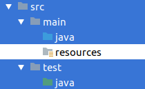
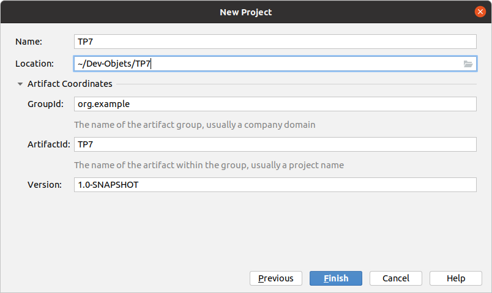

#  Bases de la programmation orientée objet 
### IUT Montpellier-Sète – Département Informatique
* **Cours:** [M2103](http://cache.media.enseignementsup-recherche.gouv.fr/file/25/09/7/PPN_INFORMATIQUE_256097.pdf) - support [ici](https://github.com/IUTInfoMontp-M2103/Ressources)
* **Enseignants:** [Marin Bougeret](mailto:marin.bougeret@umontpellier.fr), [Sébastien Gagné](mailto:sebastien.gagne@umontpellier.fr), [Victor Poupet](mailto:victor.poupet@umontpellier.fr), [Petru Valicov](mailto:petru.valicov@umontpellier.fr), [Bruno Yun](mailto:bruno.yun@umontpellier.fr) 
* Le [forum Piazza](https://piazza.com/class/jpv7gf0lltk4kc) de ce cours pour poser vos questions
* [Email](mailto:petru.valicov@umontpellier.fr) pour une question d'ordre privée concernant le cours.

Avant de démarrer le TP, vérifiez que vous n'avez pas atteint votre quota d'espace de stockage autorisé :
* placez-vous dans votre `$HOME` et utilisez les commandes suivantes :
    * `du -sh` pour voir combien d'espace vous avez déjà utilisé
    * `du -sh *` pour voir combien d'espace vous avez déjà utilisé pour chaque fichier (sans fichiers cachés)
    * `du -sch .[!.]* *` pour voir combien d'espace vous avez déjà utilisé pour chaque fichier, y compris les fichiers cachés
* Supprimez les fichiers inutiles.
* Pour éviter des problèmes durant vos TPs d'informatique, vous devriez toujours **garder 300-400 Mo d'espace libre**.

## TP7
#### _Thème : Création d’un projet Java et manipulations de quelques collections_

Cliquez sur le lien ci-dessous pour faire votre fork privé du TP (**attention, pas de fork à la main !**):

https://classroom.github.com/a/fqHlolse

Date limite de rendu de votre code sur le dépôt GitHub : **Dimanche 24 mars à 23h00**

Ce (court) TP a deux buts :

1. Vous apprendre à construire un projet _Java_ avec votre IDE en utilisant une convention standard (ici _Maven_)

2. Reprendre proprement l'[exercice 4 du TP6](https://github.com/IUTInfoMontp-M2103/TP6#exercice-4) dans ce nouveau projet et améliorer l'efficacité de votre framework de résolution de jeux construit au [TP6](https://github.com/IUTInfoMontp-M2103/TP6), en utilisant les différentes collections vues en cours

### Exercice 1
#### Organisation du projet Java - convention Maven

Depuis les premiers TPs de POO nous avons utilisé la convention [Maven](https://fr.wikipedia.org/wiki/Apache_Maven).
Pour rappel, voici l'organisation du code dans cette convention :


* l'intégralité des sources du projet se trouve dans le répertoire `src/`
* le code source et fichiers source principaux se trouvent dans `src/main`
* tous les fichiers de tests sont dans `src/test`



* le code source (ou code applicatif) se trouve dans `src/main/java`

* le code source de test se trouve dans `src/test`

**Maven** est un system de _build_ et administration de projets Java. Pour faire une analogie vous pouvez le comparer
à l'outil [make](https://fr.wikipedia.org/wiki/Make), qui existe depuis les années '70 et qui est largement utilisé dans
les systèmes de type UNIX. On aurait pu se contenter d'utiliser **make** si l'ensemble des dépendances à gérer n'était pas
conséquent et lourd à configurer à la main (la version du compilateur _Java_, la version du byte-code généré par le compilateur,
les librairies de tests unitaires, etc.). D'autre part, utiliser _make_ pour respecter une organisation des répertoires
et des packages _Java_ peut s'avérer long.
Pour gérer tous ces aspects, plusieurs outil de _build_ sont recommandés :  [Maven](https://fr.wikipedia.org/wiki/Apache_Maven),
[Gradle](https://fr.wikipedia.org/wiki/Gradle), [Ant](https://fr.wikipedia.org/wiki/Apache_Ant) et bien d'autres. Dans ce
cours le choix a été porté sur *Maven*, mais on aurait pu très bien utiliser un autre outil (de même qu'on aurait pu
utiliser _C++_, _C#_ ou encore _Python_ pour vous apprendre à programmer en orienté objet...). Vous avez peut-être
remarqué qu'utiliser *Maven* permet de gérer facilement toutes les dépendances du projet. Le fait que l'ensemble de
fichiers sources et exécutables soient organisés et que cette organisation soit faite de manière "transparente" est
clairement un bénéfice. Par exemple, vous n'avez pas eu à installer des logiciels spécifiques, autres que votre IDE pour
faire fonctionner vos programmes. Il est également utile pour créer le fichier `.jar` du projet : une archive contenant
l'ensemble de classes _Java_ et de ressources d'un projet informatique (comme `.AppImage` sous Linux ou `.exe` sous Windows).
 
**Remarque** : L'utilisation de *Maven* est indépendante de votre IDE. Que ce soit [IntelliJ IDEA](https://www.jetbrains.com/idea/),
[Eclipse](https://www.eclipse.org/), ou [NetBeans](https://netbeans.org/), la plupart des IDEs de développement _Java_
ont une intégration facile de *Maven*.

L'objectif de cet exercice est de vous apprendre à construire un projet _Java_ en suivant la convention *Maven*
à partir de rien. Nous allons illustrer les étapes pour _IntelliJ IDEA_, libre à vous d'adapter ce tutoriel pour un autre
IDE que vous préférez.

1. Lancez l'IDE et fermer si nécessaire le projet sur lequel vous étiez en train de travailler précédemment. Vous devez
vous retrouvez avec une fenêtre comme celle-ci :


Cliquez sur _Create New Project_.

2. Une fenêtre de création va apparaître et va rassemble à ceci :


Choisissez le modèle _Maven_ et vérifiez que la SDK correspond à _Java 1.8_ ou une version supérieure &rightarrow; _Next_

3. Dans la fenêtre ci-dessous vous devez indiquer les informations permettant d'identifier votre projet parmi la liste
de projets que vous avez déjà créée :


  
  * **GroupId** donne identifiant à votre projet. Puisque nous construisons un projet _Java_, il faudrait respecter les
  conventions de nommage du langage. Ici la convention est la même que pour les packages : on indique le domaine dans
   l'ordre inverse. Par exemple, `org.apache.maven`, `org.apache.commons`. Pour ce TP vous allez choisir `fr.umontpellier.iut`.
  
  * **artifactId** est le nom de l'exécutable (fichier `.jar`) qui pourra être créé à partir de ce projet.
  
  * **version** - le nom de version si ce code est destiné à être distribué. Ici vous pouvez laisser 1.0-SNAPSHOT. Cela
  voudra dire qu'il s'agit de la version _en cours de développement_ de la version 1.0 de votre logiciel. Pour la version
  finale, le mot-clé SNAPSHOT devra être enlevé.
  
Cliquez sur _Next_.

4. La page suivante vous permet d'indiquer le répertoire où va résider votre projet :


Après avoir indiqué le répertoire, cliquez sur _Finish_.

5. Et voilà, vous venez de créer un projet _Java_ en suivant la convention Maven. La page que vous allez trouver, va rassembler
à quelque chose comme ceci :


Notez le fichier XML qui vous sera affiché (`pom.xml`). Ce fichier, appelé
[_Project Object Model_](https://maven.apache.org/guides/introduction/introduction-to-the-pom.html), contient
l'ensemble des informations concernant votre projet et sa configuration. C'est ici que seront stockées l'ensemble des
dépendances de votre projet. Si vous utilisez la version 1.8 de _Java_, vous pouvez remplir votre `pom.xml` comme suit :

```xml
<?xml version="1.0" encoding="UTF-8"?>
<project xmlns="http://maven.apache.org/POM/4.0.0"
         xmlns:xsi="http://www.w3.org/2001/XMLSchema-instance"
         xsi:schemaLocation="http://maven.apache.org/POM/4.0.0 http://maven.apache.org/xsd/maven-4.0.0.xsd">
    <modelVersion>4.0.0</modelVersion>
    <groupId>fr.umontpellier.iut</groupId>
    <artifactId>TP7</artifactId>
    <version>1.0-SNAPSHOT</version>
    <properties>
        <maven.compiler.source>1.8</maven.compiler.source>
        <maven.compiler.target>1.8</maven.compiler.target>
        <project.build.sourceEncoding>UTF-8</project.build.sourceEncoding>
    </properties>
    <dependencies>
        <dependency>
            <groupId>org.junit.jupiter</groupId>
            <artifactId>junit-jupiter-engine</artifactId>
            <version>5.4.0-M1</version>
            <scope>test</scope>
        </dependency>
        <dependency>
            <groupId>org.junit.vintage</groupId>
            <artifactId>junit-vintage-engine</artifactId>
            <version>5.4.0-M1</version>
            <scope>test</scope>
        </dependency>
        <dependency>
            <groupId>org.junit.jupiter</groupId>
            <artifactId>junit-jupiter-api</artifactId>
            <version>5.4.0-M1</version>
        </dependency>
    </dependencies>
    <build>
        <plugins>
            <plugin>
                <groupId>org.apache.maven.plugins</groupId>
                <artifactId>maven-surefire-plugin</artifactId>
                <version>2.22.0</version>
            </plugin>
            <plugin>
                <groupId>org.apache.maven.plugins</groupId>
                <artifactId>maven-failsafe-plugin</artifactId>
                <version>2.22.0</version>
            </plugin>
            <plugin>
                <groupId>org.apache.maven.plugins</groupId>
                <artifactId>maven-compiler-plugin</artifactId>
                <configuration>
                    <source>8</source>
                    <target>8</target>
                </configuration>
            </plugin>
        </plugins>
    </build>
</project>
```
Pour les autres versions de _Java_ il faudra adapter les lignes correspondantes. Il vous est également conseillé de lire la documentation là-dessus :

https://maven.apache.org/what-is-maven.html

https://maven.apache.org/guides/introduction/introduction-to-the-pom.html

6. Après avoir effectué les premières modifications du fichier POM de votre projet, il faudra penser indiquer à votre IDE
quand est-ce que vous aimeriez qu'il prenne en compte les changements de ce fichier. Une fenêtre comme ci-dessous devrait
apparaître :

  
   
   Pour faire plus simple, vous pouvez choisir l'option _Enable Auto-Import_ afin que tout changement du fichier POM soit
pris en compte immédiatement.


7. Maintenant, que votre projet est prêt, n'oubliez pas de versionner votre travail. On vous rappelle rapidement les commandes
   à exécuter dans le terminal (attention, si vous utilisez votre IDE pour faire cela, lisez/vérifiez avant de cliquer...) :

 * initialisez la racine de votre projet (qui s'appelle sans doute _TP7_) comme un dépôt Git
 * ajoutez votre dépôt privé distant comme _remote_ : `git remote add origin https://github.com/IUTInfoMontp-M2103/TP7-VOTRELOGIN`
 * rappelez l'intérêt du fichier `.gitignore` et ajoutez le à la racine de votre projet. Vous pouvez récupérer un modèle utilisé
   pour un autre TP fait auparavant (par exemple celui du TP6). Pour les utilisateurs des IDEs autres que IntelliJ IDEA
   (par exemple Eclipse) il faudra adapter le `.gitignore`.
 * synchronisez le dépôt distant avec votre dépôt local (avec `git pull origin master` et `git push`); ici vous serez amenés à faire
   une fusion (_merge_) avec le dépôt distant forké par le lien qui vous a été fourni.
 
Désormais tout devrait être fonctionnel et vous pouvez commencer sereinement à créer vos classes _Java_ et programmer
comme d'habitude.

### Exercice 2

1. Copiez dans le répertoire `src/main/java` (respectivement `src/test/java`), l'ensemble des classes et interfaces métiers
 (respectivement de test) créées dans l'[exercice 4 du TP6](https://github.com/IUTInfoMontp-M2103/TP6#exercice-4)
 et vérifiez que votre programme principal fonctionne correctement. Pensez à mettre toutes ces classes dans un package approprié. Par exemple `fr.umontpellier.iut` si vous comptez vous arrêtez à l'implémentation des algorithmes de résolution; et `fr.umontpellier.iut.framework` ou `fr.umontpellier.iut.traitement` si vous voulez ajouter d'autres composants (comme une interface graphique que vous mettriez dans `fr.umontpellier.iut.affichage`).
 
2. Observez les collections que vous avez utilisées pour modéliser les variables `dejaVus`, `frontiere`, ainsi que les
fils d'une configuration de jeu donnée (retournés par la méthode `genererFils()`). Réflechissez aux inconvénients des
structures de données choisies (voir également le [cours](http://pageperso.lif.univ-mrs.fr/~petru.valicov/Cours/M2103/BPOO_Genericite_Structures_de_Donnees_x4.pdf)
pour cela). Que constatez-vous ?

3. Rappelez-vous la spécification de la variable `dejaVus` et notez le test d'appartenance à `dejaVus` dans la méthode
`resoudre()` de la classe `Contexte`. Proposez une collection plus appropriée pour modéliser cette variable et modifiez
(i.e. refactorisez) votre code de manière correspondante.
