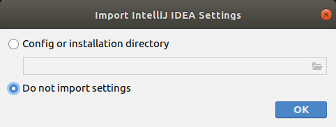
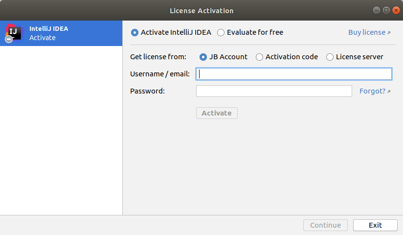
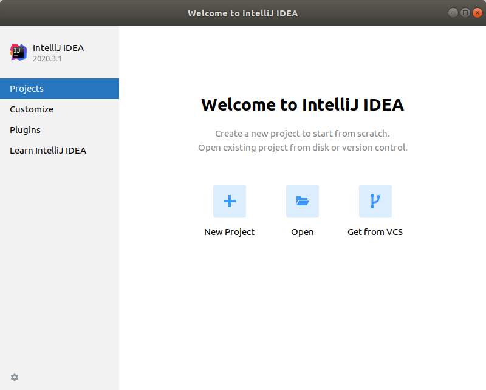
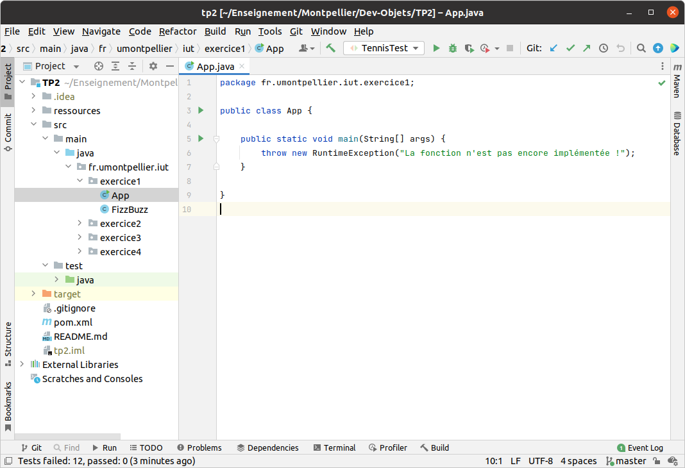
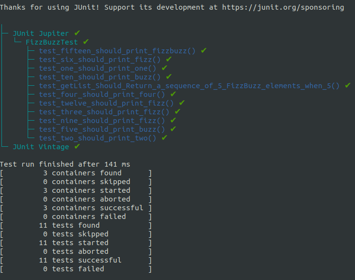

#  Développement Orienté Objets

### IUT Montpellier-Sète – Département Informatique

* [**Support de cours**](https://gitlabinfo.iutmontp.univ-montp2.fr/dev-objets/Ressources)
* **Enseignants:**
  [Marin Bougeret](mailto:marin.bougeret@umontpellier.fr),
  [Gaëlle Hisler](mailto:gaelle.hisler@umontpellier.fr),<!--[Sophie Nabitz](mailto:sophie.nabitz@univ-avignon.fr),-->
  [Victor Poupet](mailto:victor.poupet@umontpellier.fr),
  [Gilles Trombettoni](mailto:gilles.trombettoni@umontpellier.fr),
  [Petru Valicov](mailto:petru.valicov@umontpellier.fr)
* Le [forum Piazza](https://piazza.com/class/kyo4oooauez252) de ce cours pour poser vos questions
* [Email](mailto:petru.valicov@umontpellier.fr) pour toute question concernant le cours.


<!--Avant de démarrer le TP, vérifiez que vous n'avez pas atteint votre quota d'espace de stockage autorisé :

* placez-vous dans votre `$HOME` et utilisez les commandes suivantes :
    * `du -sh` pour voir combien d'espace vous avez déjà utilisé
    * `du -sh *` pour voir combien d'espace vous avez déjà utilisé pour chaque fichier (sans fichiers cachés)
    * `du -sch .[!.]* *` pour voir combien d'espace vous avez déjà utilisé pour chaque fichier, y compris les fichiers cachés
* Supprimez les fichiers inutiles.
* Pour éviter des problèmes durant vos TPs d'informatique, vous devriez toujours **garder 300-400 Mo d'espace libre**.
-->

## TP 2 : Prise en main de l'IDE et travail en mode TDD
Pendant les TP nous vous conseillons d'utiliser un environnement de développement intégré (IDE en anglais).
Les avantages sont multiples : le refactoring du code, l'auto-complétion, la suggestion des méthodes/attributs/classes,
la documentation intégrée, le debuggage, une bonne intégration de Git, GitLab et GitHub, des tests unitaires, etc.
Dans ce cours nous utiliserons l'IDE **[IntelliJ IDEA](https://www.jetbrains.com/idea/)** de chez **[JetBrains](https://www.jetbrains.com)**. Il devrait vous faciliter la vie au quotidien dans la réalisation de vos TP.
Bien évidement, rien ne vous empêche d'en utiliser un autre ([Eclipse](https://www.eclipse.org/), [NetBeans](https://netbeans.org/) etc.).

Votre fork de ce TP (_tp2-votre-login_) a été créé dans le groupe [Dev-Objets](https://gitlabinfo.iutmontp.univ-montp2.fr/dev-objets).
Vous pouvez d'ores et déjà le cloner localement sur votre machine dans votre répertoire de travail. Vous pouvez également attendre et le faire à travers l'IDE (voir ci-dessous).

### Premiers pas avec l'IDE

IntelliJ IDEA possède deux versions, la première dite *'Communautaire'* est totalement open source et peut être utilisée gratuitement par n'importe qui et la seconde dite *'Ultimate'* qui est plus riche en fonctionnalités et qui n'est pas gratuite. Pour les TPs qui vont suivre vous aurez besoin de la version '*Ultimate*' et en tant qu'étudiant, vous avez la possibilité de pouvoir bénéficier d'une licence pour tous les produits JetBrains.

**Installation et premier lancement de l'IDE**
* Si vous êtes au département, sur les postes Linux vous trouverez l'installation dans `/opt/idea-Ultimate/`. Pour le lancer :

    ```
    ~/RepertoireCourant$  cd /opt/ide-Ultimate/bin
    /opt/idea-Ultimate/bin$  ./idea.sh
    ```

* Si vous utilisez votre propre machine :
  * sur Ubuntu le plus simple pour installer l'IDE c'est d'utiliser _Snap_, qui est un système de distribution de logiciels simplifié et qui est pré-installé sur toutes les versions récentes d'Ubuntu. À partir d'un terminal tapez :

      ```
      sudo snap install intellij-idea-ultimate --classic
      ```
  * sur Windows, Mac OS, ou Linux on peut faire l'installation depuis un exécutable -- il suffit de le télécharger ici : https://www.jetbrains.com/help/idea/installation-guide.html#standalone

<!-- Le téléchargement et l'installation risquent de prendre un peu de temps, donc en attendant vous pouvez demander la licence et vous familiariser avec les consignes qui suivent. Les étapes qui vont suivre s'appliquent quelque soit votre système d'exploitation.

Pour installer l'IDE sur Linux, vous devez extraire l'archive dans un endroit qui va bien (dans votre `$HOME` par exemple) et lancer l'exécutable se trouvant dans le répertoire `idea-IU-***.tar.gz/bin/`. Depuis un terminal :

```
cd repertoire_contenant_l_archive_que_vous_venez_de_telecharger

tar -zxvf ideaIU-***.tar.gz --directory ~/

cd ~/idea-IU-***/bin/

./idea.sh
```
-->


**Obtention de la licence académique Ultimate**

Pour bénéficier de la licence académique, il vous suffit de remplir [ce formulaire](https://www.jetbrains.com/shop/eform/students) en utilisant votre adresse universitaire.

Quelques minutes après, vous recevrez un email de confirmation suivi d'un second email d'activation où vous devrez accepter les conditions d'utilisation et choisir un nom d'utilisateur et un mot de passe. Conservez précieusement ces informations, car c'est grâce à elles que vous pourrez importer votre licence sur toutes les machines que vous allez utiliser (chez vous, à l'IUT etc).

**Premier lancement de l'IDE**

Une fois que l'installation est terminée, lancez l'exécutable. Vous devriez tomber sur une première fenêtre vous proposant d'importer vos paramètres.
Normalement, vous n'avez rien à importer :



Ensuite vous devriez saisir vos données de connexion pour activer la licence :



Votre licence académique est désormais active sur votre machine. Normalement vous devriez arriver sur la fenêtre de démarrage de l'IDE :



Ici, si vous souhaitez, vous pouvez personnaliser votre installation (menu _Customize_) -- choisissez ce qui vous convient le mieux.
Vous êtes presque prêt à commencer à coder !

**Import du projet dans l'IDE**

Maintenant, depuis l'onglet _Projects_ vous devez choisir comment vous souhaitez démarrer le travail.
Pour le TP d'aujourd'hui il faudra cloner votre dépôt depuis [GitLab](https://gitlabinfo.iutmontp.univ-montp2.fr/dev-objets/) (_tp2-VotreLogin_).
Normalement l'installation Git de votre machine a déjà été détecté par votre IDE, donc vous choisirez l'option *Get from VCS*, ou _VCS_ signifie _Version Control_.
L'URL sera celui correspondant à votre fork du TP2 sur GitLab :


Rappelez-vous que votre fork du TP2 est privé, donc une authentification est nécessaire. Si vous avez bien fait les étapes du [tutoriel Git](https://gitlabinfo.iutmontp.univ-montp2.fr/valicov/tutoGit1ereAnnee) du [TP1](https://gitlabinfo.iutmontp.univ-montp2.fr/dev-objets/TP1), alors passer dans l'URL le lien de clone à travers SSH serait le plus simple car vous n'aurez pas besoin de vous authentifier manuellement.

Vous venez de cloner avec l'IDE votre premier dépôt Git depuis un serveur distant (le GitLab de l'IUT).

Lorsque vous ouvrez votre projet Java, la fenêtre d'affichage de votre IDE devrait rassembler à quelque chose comme ceci :



Prenez quelques minutes pour observer l'interface utilisateur. Les éléments principaux :
* à gauche : l'arborescence de votre projet Java
* centre-droite : la fenêtre d'édition où vous allez taper vos programmes
* en bas : le terminal où seront affichés les messages concernant l'exécution de vos programmes

Sur certaines machines, au premier lancement du projet et à l'ouverture d'une classe Java, il se peut que l'IDE
vous demande d'indiquer le SDK à utiliser (grosso modo c'est l'ensemble d'outils logiciels qui permettent de faire tourner des programmes Java) :


Si vous avez ce problème, cliquez sur _SetUp SDK_ et choisissez celui par défaut ou une autre version supérieure à 17.


### Workflow

Maintenant que vous savez utiliser Git en ligne de commande, que vous avez forké, importé et ouvert le TP dans votre IDE,
vous êtes en capacité de travailler sur vos exercices. Pour cette séance nous vous proposons de suivre un workflow particulier pour résoudre vos exercices progressivement et en consolidant
progressivement un filet de sécurité qui vérifiera que votre code continue à bien faire ce qu'il doit. Il s'agit d'un premier aperçu de ce qu'on appelle le Développement Piloté par les Tests ([Test-Driven Development](https://fr.wikipedia.org/wiki/Test_driven_development) ou TDD pour faire court).

Le TDD est une méthode de développement de logiciels qui consiste
à travailler sur des cycles de développement très courts. La conception apparaît au fur et à mesure du développement en commençant à écrire les tests avant le code applicatif. Ceci favorise une meilleure compréhension du problème. Pour le développeur, les tests vont constituer une spécification technique exécutable et vérifiable à tout
moment. Ainsi en ajoutant des tests au fur et à mesure, le développeur converge progressivement à la fois vers une spécification plus fine
et un code fonctionnel associé.

Ci-dessous le déroulement d’un cycle :
1. Écrire un premier test automatique qui est censé définir une nouvelle fonctionnalité. Le test
   doit s’écrire **avant la fonctionnalité voulue**, il est donc censé échouer initialement (normal, car vous n'avez encore rien programmé).
2. Écrire le code __minimal__ suffisant pour passer le test (principe _BabySteps_).
3. Vérifier que le test passe.
4. __Refactoriser__ (simplifier, améliorer, optimiser, etc.) tout le code tout en gardant la fonctionnalité. Durant cette étape les tests écrits préalablement sont exécutés en permanence pour certifier la validité des changements.


Ce workflow se décrit par le triptyque "FAIL, PASS, REFACTOR" dans le schéma suivant :


Le workflow que vous devrez suivre va reprendre la même structure, mis à part qu'au début, les tests vous seront donnés pour vous faire découvrir cette méthode sans trop de douleur.

#### Et au fait les tests, c'est quoi ?

Un **test unitaire** est une méthode écrite par le programmeur afin de vérifier qu'une fonctionnalité _précise_ et _élémentaire_ fonctionne correctement.
Le terme _unitaire_ insiste sur le côté "élémentaire" de la fonctionnalité (unité) à tester.

L'outil le plus répandu pour gérer les tests unitaires en Java est le framework [JUnit](https://junit.org/junit5/).
Les tests sont écrits sous forme de fonctions dans une classe Java. Pour que le compilateur puisse faire la différence entre une fonction de test et une fonction "normale", il faut ajouter l'annotation `@Test`. Celle-ci doit précéder chaque test unitaire. Exemple :
```java
import static org.junit.jupiter.api.Assertions.assertEquals;
import org.junit.jupiter.api.Test;

class MaPetiteClasseDeTests {
    
    @Test
    void monJoliPremierTest() {
        assertEquals(3, 1 + 2); // On vérifie que la valeur attendue 3 est bien le résultat de 1 + 2
    }
}
```

Pour exécuter les tests, la façon la plus simple est d'utiliser votre IDE : ouvrir la classe contenant le test et
utiliser le bouton 'Play' pour exécuter les tests contenus dans cette classe.
Le résultat de l’exécution s'affiche en bas de la fenêtre de l'IDE :
* les tests ayant **réussi** sont affichés en **vert**
* les tests ayant **échoué** sont en **rouge**

Votre IDE vous affiche également la cause de l'échec en vous indiquant le résultat attendu de la fonctionnalité testée
et le résultat effectif.

#### Organisation du projet Java - convention Maven
Dans tous les projets informatiques sérieux, les tests sont systématiquement séparés du code testé.
Pour le faire, nous allons utiliser la convention [Maven](https://fr.wikipedia.org/wiki/Apache_Maven)
dans l'ensemble des TPs de Dev-Objets.
Ainsi le code sera organisé de la façon suivante :


* l'intégralité des sources du projet se trouve dans le répertoire `src/`
* le code source et fichiers source principaux se trouvent dans `src/main`
* tous les fichiers de tests sont dans `src/test`


* le code source (ou code applicatif) se trouve dans `src/main/java`
* le code source de test se trouve dans `src/test/java`


Maven est un système de _build_ et administration de projets Java. Pour faire une analogie vous pouvez le comparer
à l'outil bien connu [make](https://fr.wikipedia.org/wiki/Make) avec lequel vous serez bercés tout au long de vos études.
Utiliser Maven permet de gérer facilement toutes les dépendances du projet (comme les librairies de tests unitaires par exemple).
Il est également utile pour créer le fichier `.jar` du projet : une archive contenant l'ensemble de classes Java et de ressources
d'un projet informatique (comme `.AppImage` sous Linux ou `.exe` sous Windows).

Comme indiqué précédemment, dans ce TP les tests unitaires vous seront donnés dans le repertoire de test correspondant.
Vous allez les activer un par un en commentant l'annotation `@Disabled`.

__La règle principale à retenir__ : avant de faire un commit, tous les tests qui ne sont pas annotés avec `@Disabled` __doivent
passer__ (pas de messages en rouge dans la console de l'IDE).


### Exercice 1 : Fizz Buzz !

Le Fizz Buzz est un des [katas](https://fr.wikipedia.org/wiki/Kata_(programmation)) les plus connus pour l'apprentissage du TDD.
Une série 'FizzBuzz' de taille `n` est une suite d'entiers positifs où, lorsqu'un multiple de 3 est rencontré on imprime "Fizz", et lorsqu'un multiple de 5 est rencontré on imprime "Buzz". Voici la série FizzBuzz de taille 20 :

1 ; 2 ; Fizz ; 4 ; Buzz ; Fizz ; 7 ; 8 ; Fizz ; Buzz ; 11 ; Fizz ; 13 ; 14 ; FizzBuzz ; 16 ; 17 ; Fizz ; 19 ; Buzz

Le programme correspondant devrait bien évidemment être très facile, mais on vous demande de l'implémenter **en suivant les consignes ci-dessous**.

* La classe à implémenter est `FizzBuzz`, située dans le paquetage `fr.umontpellier.iut.exercice1`.
  Elle contient deux fonctions qu'il faudra compléter :
  - `getValue(int i)` qui retournera une chaîne de caractères correspondant au nombre `i`dans la série FizzBuzz
  - `computeList(int n)` qui retournera toute la série 'FizzBuzz' jusqu'à la valeur passée en paramètre

* La classe contenant les tests est située dans le répertoire correspondant au paquetage `fr.umontpellier.iut.exercice1` dans l'arborescence `src/test` de votre projet.
  - Vous activerez les tests les uns après les autres, et pour chaque tests vous passerez les trois étapes d'une itération : FAIL, PASS, REFACTOR.
  - Vous soumettrez (avec un `git commit`) votre solution après __chaque itération__ du cycle principal du workflow.

Même si l'exercice paraît facile, prêtez une attention particulière à l'étape de **refactorisation** (c.-à-d. simplification/nettoyage/suppression des redondances).
Commencez à vous servir de votre IDE pour vous faire assister : renommer les variables, renommer les fonctions, utiliser l'autocomplétion, etc.

Notez que pour faire évoluer le code des fonctions de la classe `FizzBuzz`, en faisant passer tous les tests, vous n'avez pas besoin de la classe principale (contenant le `main`).
Et c'est très bien ainsi, car le rôle du `main` est de faire tourner l'application en faisant communiquer tous les objets de l'application et pas de vérifier les bêtises écrites dans chaque classe de l'application...

Une fois que votre classe `FizzBuzz` est valide, vous pouvez implémenter le `main` de la classe principale `App`,
qui se trouve dans le paquetage `fr.umontpellier.iut.exercice1`. Implémentez-la (supprimez la ligne qui lève une erreur) pour simuler le bon fonctionnement de votre programme.


### Exercice 2 : Facteurs Premiers

D'après le Théorème fondamental de l'arithmétique, tout entier strictement positif peut être écrit comme un produit de nombres premiers. Il vous est demandé d'implémenter la méthode qui, pour un entier strictement positif donné, renvoie la liste de ses facteurs premiers en ordre croissant.
Par exemple pour l'entier 5, la liste retournée devrait être [5], alors que pour l'entier 12, la liste retournée devrait être [2,2,3].

La méthode que vous devez implémenter est `computeFactors(int)`, située dans la classe `PrimeFactors` du paquetage `fr.umontpellier.iut.exercice2`. Cette fonction devra renvoyer la liste (type [ArrayList](https://docs.oracle.com/en/java/javase/17/docs/api/java.base/java/util/ArrayList.html) défini en Java) de facteurs premiers pour l'entier passé en paramètre. Voici comment on utiliser des `ArrayList` contenant des entiers :
```java
ArrayList<Integer> maListeJava = new ArrayList<>(); // déclaration + instanciation de liste vide
maListeJava.add(42); // ajout de l'entier 42 à la fin de la liste
maListeJava.add(-7);  // ajout de l'entier -7 à la fin de la liste
maListeJava.add(2);  // ajout de l'entier 2 à la fin de la liste
System.out.println(maListeJava); // affiche [42, -7, 2]
maListeJava.remove(1); // supprime l'élément à la position 1 dans la liste
System.out.println(maListeJava); // affiche [42, 2]
```

Comme pour l'exercice précédent, vous activerez les tests un par un en réalisant le code minimal nécessaire. N'oubliez pas de __refactoriser__ le code à chaque étape. Vous soumettrez avec Git votre solution après chaque itération du cycle principal du workflow.

À la fin de l'exercice, pour vous convaincre de la validité de votre code, vous ajouterez deux-trois tests supplémentaires pour deux nombres que vous aurez choisis aléatoirement (par exemple, dans un terminal avec la commande `echo $RANDOM`). Est-ce que votre programme passe ce nouveau test ?


### Exercice 3 : Jeu de Tennis
Le but ici est d'écrire un petit programme permettant de gérer les scores de deux joueurs dans un jeu de tennis. Seul le jeu nous intéresse ici (pas les sets, ni le match).

Le comptage des points dans un jeu se fait de la manière suivante :
* Chaque joueur peut avoir un des quatre points suivants : “0” “15” “30” “40”
* Le jeu est remporté par le premier joueur ayant remporté 4 points consécutifs et au moins 2 points de plus que son adversaire
* Si les deux joueurs sont à 40, alors ils sont à "_égalité_"
* Si les deux joueurs sont à égalité, alors le gagnant du point suivant obtient un "_avantage_"
* Si un joueur a l'avantage et gagne le point, alors il remporte le jeu
* Si un joueur a l'avantage et perd le point, alors les deux joueurs reviennent à égalité

Complétez la classe `Tennis` en travaillant en mode TDD : activer les tests un par un et écrivez le code **minimal** nécessaire pour valider le test tout en vérifiant que les tests précédemment validés, passent. N'oubliez pas la phase de **refactorisation** à chaque étape (c.à.d. simplification/nettoyage/factorisation des redondances).

La fonction `getScore()` doit retourner le texte correspondant à l'état de la partie (analyser le texte utilisé dans les tests pour comprendre l'affichage).

Dans cet exercice, vous aurez à manipuler les chaînes de caractères de type [`String`](https://docs.oracle.com/en/java/javase/17/docs/api/java.base/java/lang/String.html). Voici quelques indications concernant le format String pour cet exercice :

* pour concaténer deux chaînes `s1` et `s2`, vous pouvez vous contenter d'utiliser `s1+s2`
* pour comparer deux chaînes `s1` et `s2`, vous utiliserez l'instruction `s1.equals(s2)`

### Exercice 4 (Bonus) : Calculette romaine

Vous êtes chargé de réaliser une calculette simplifiée qui effectue des additions et des soustractions des nombres écrits en numérotation romaine. Dans cette numérotation on utilise des caractères parmi sept lettres de l'alphabet latin : `I`, `X`, `L`, `C`, `D` et `M`. La signification en numérotation décimale classique est donnée ci-dessous :


| I | V | X  | L  |  C  |  D  |  M   |
|---|---|----|----|-----|-----|------|
| 1 | 5 | 10 | 50 | 100 | 500 | 1000 |


Un nombre romain se lit de gauche à droite en faisant des additions et des soustractions des valeurs des chiffres. Tout symbole qui suit un symbole de valeur supérieure ou égale s’ajoute à celui-ci (exemple : 6 s'écrit `VI`). Tout symbole qui précède un symbole de valeur supérieure se soustrait à ce dernier (exemple : 40 s'écrit `XL`). Par exemple le nombre romain `MLXIII` correspond à 1063 dans la numérotation décimale car il se décompose comme `M`+`L`+`X`+`I`+`I`+`I` = 1000+50+10+1+1+1. Alors que le nombre `XXXIV` vaut 34 car il se décompose comme `X`+`X`+`X`+`IV`=10+10+10+4. Une meilleure façon de voir ce dernier exemple c'est d'utiliser la soustraction `X`+`X`+`X`-`I`+`V`=10+10+10-1+5.

On va se fixer une représentation unique des nombres romains avec les principes suivants :
- Un même symbole n'est pas employé quatre fois de suite (sauf `M`).
- Les soustractions s'effectuent sur un seul symbole (par exemple `XL` est correct et vaut 40, mais il est interdit d'écrire `XXL` pour 30, et on écrira plutôt `XXX`).
- On écrira en respectant l'ordre suivant
  - d'abord les chiffres des milliers (à l'aide uniquement de `M`)
  - puis les chiffres des centaines (à l'aide uniquement de `C`,`D`,`M`)
  - puis les chiffres des dizaines (à l'aide uniquement de `X`,`L`,`C`)
  - puis les chiffres des unités (à l'aide uniquement de `I`,`V`,`X`)
- Pour chacune des 4 étapes ci-dessus, on utilisera le moins de symboles possible.

Par exemple :
- `IL` (pour 49) est interdit (I n'est pas autorisé pour décrire les dizaines), et 49 = `XLIX`
- `XCM` est interdit (car que l'on interprète comme `X` `CM` ou `XC` `M`, cela ne respecte pas l'ordre ci-dessus)
- `VX` (pour 5) est interdit, car `V` utilise moins de symboles
- `XCXX` (pour 110) est interdit, car il faut décrire le chiffre des centaines avec `C`,`D`, `M`.


Faites très attention pour cet exercice de bien respecter le principe du TDD en ajoutant vraiment tout le temps la quantité minimale de code nécessaire à la validation des tests. Si vous suivez cette règle, il se résout très facilement alors qu'en l'abordant de manière générale, il comporte de nombreux pièges pouvant vous faire perdre un temps précieux.

Dans cet exercice, vous allez manipuler la classe [`String`](https://docs.oracle.com/en/java/javase/17/docs/api/java.base/java/lang/String.html). Cette classe possède de nombreuses méthodes utilitaires pour manipuler facilement les chaînes de caractères.

**Convertisseur de nombres romains**

Écrivez la classe Java `RomanToNumeral` donnée. Cette classe aura une méthode  `getNumeral()` qui prend un nombre romain en paramètre et retourne sa valeur en numérotation décimale (un type `int`).

N'oubliez pas de faire des "commits" au fur et à mesure !

**Convertisseur de nombres décimaux**

Écrivez la classe `NumeralToRoman` qui contiendra une méthode `getRoman()`, qui prend un nombre entier en paramètre et retourne sa valeur en numérotation romaine (de type `String` donc).

Est-ce que vos tests sont suffisants ? Que se passe-t-il lors de la conversion `romain` -> `décimal` -> `romain` ?

**Additionneur romain**

En utilisant les deux classes écrites précédemment, créez une classe `RomanAdditionner` qui contiendra une méthode `String compute()`. Cette méthode prendra en paramètre une chaîne de caractères représentant une expression arithmétique romaine telle que :

- les opérandes sont écrits en numérotation romaine
- les opérations possibles sont `+` et `-`

Le retour de cette fonction devra correspondre au résultat du calcul de l'expression arithmétique écrit sous forme d'un nombre romain.
Par exemple pour l'expression arithmétique `MMMXL` + `XII` - `CIX` passée en paramètre, la valeur retournée devrait être : `MMCMXLIII`.

Afin de vérifier votre code, vous pouvez écrire quelques tests unitaires dans une nouvelle classe de test (par ex. `RomanAdditionnerTest` dans le paquetage `fr.umontpellier.iut.exercice4`).

### Et ce n'est pas fini !

Vous trouverez d'autres katas qui vous permettront de mieux apprendre la programmation en mode TDD : http://codingdojo.org/kata/

Dans tous les cas gardez cette citation d'Edsger W. Dijkstra en tête :
> Program testing can be used to show the presence of bugs, but never to show their absence.


### Si l'IDE n'est pas votre tasse de thé...

Évidemment vous pouvez faire tout en ligne de commandes.
Supposons que vous êtes sur Linux (la démarche étant quasiment identique sur Windows ou MacOS) et que la racine de votre projet est le répertoire `~/Dev-Objets/TP2`.
Positionnez-vous dans ce répertoire :
```
~/RepertoireCourant$ cd ~/Dev-Objets/TP2
~/Dev-Objets/TP2$ ls
~/Dev-Objets/TP2$ pom.xml  README.md  src  target  tp2.iml
```

Pour compiler le code source de l'exercice 1 à partir de la racine de votre projet :

```
~/Dev-Objets/TP2$  javac -d target/ src/main/java/fr/umontpellier/iut/exercice1/*.java
```

L'option `-d target` permet d'indiquer que la destination des fichiers compilés est le répertoire `target/`
Également, avec l'option `-sourcepath`, il est possible d'indiquer le chemin où le compilateur va chercher
l'ensemble du code source à compiler :
```
~/Dev-Objets/TP2$  javac -sourcepath src/ -d target src/main/java/fr/umontpellier/iut/exercice1/*.java
```

Pour exécuter le programme compilé :
```
~/Dev-Objets/TP2$  cd target/
~/Dev-Objets/TP2/target$  java fr.umontpellier.iut.exercice1.App
```
L'avantage d'utiliser un IDE est qu'à priori vous n'avez pas à installer les diverses dépendances, car le logiciel se débrouille tout seul.
En revanche, si vous passez par la console, il se peut que vous soyez amenés à installer ou importer divers outils.
Notamment, pour exécuter les tests unitaires dans un terminal, il faudrait utiliser un exécutable `.jar` correspondant à la plateforme JUnit que vous souhaitez. Cet exécutable contient l'ensemble de dépendances nécessaires et sa dernière version est disponible [ici](https://mvnrepository.com/artifact/org.junit.platform/junit-platform-console-standalone/1.8.2). Une fois le `.jar` téléchargé, vous pouvez l'utiliser pour compiler et exécuter vos classes de tests :
```
~/Dev-Objets/TP2$  javac -d target -cp target:junit-platform-console-standalone-1.8.2.jar src/test/java/fr/umontpellier/iut/exercice1/*.java

~/Dev-Objets/TP2$  java -jar junit-platform-console-standalone-1.8.2.jar --class-path target --select-class fr.umontpellier.iut.exercice1.FizzBuzzTest

```
Voici le résultat que vous devrez obtenir (dans cet exemple tous les tests passent) :



La solution ci-dessus peut s'avérer particulièrement pénible lorsque vous avez plusieurs classes de tests,
dans différents packages. Le plus simple, c'est d'utiliser un outil de "build" comme Maven,
[Gradle](https://fr.wikipedia.org/wiki/Gradle), [Ant](https://fr.wikipedia.org/wiki/Apache_Ant), [make](https://fr.wikipedia.org/wiki/Make) etc.
Par exemple, si Maven est installé sur votre machine vous pouvez exécuter les tests en ligne de commande assez facilement.
Pour cela, placez-vous à la racine de votre projet et tapez la commande suivante :

```
~/Dev-Objets/TP2$  mvn test
```
Le résultat obtenu devrait rassembler à quelque chose comme ceci :


L'exécution de la classe principale avec Maven depuis la ligne de commande est également plus simple que la méthode "rudimentaire" avec `javac` + `java`
:

```
~/Dev-Objets/TP2$ mvn exec:java -Dexec.mainClass="fr.umontpellier.iut.exercice1.App"
```
